**Arquitectura Funcional de la Aplicación&#32;`cus_movil`**

```mermaid
graph TD

    subgraph 0c2f4548-AppArch["**Arquitectura Funcional de la Aplicación&#32;`cus_movil`**<br>Mobile Cross-Platform con Flutter<br>[External]"]
        0c2f4548-EXTERNAL_APIS["**APIs Externas / Backend**<br>Servicios REST<br>[External]"]
        subgraph 0c2f4548-AppFunctions["**Funciones Primarias de la Aplicación**<br>[External]"]
            0c2f4548-AUTH_USER_MGMT["**Autenticación y Gestión de Usuarios**<br>Login, Registro, Perfil<br>[External]"]
            0c2f4548-DOC_HANDLING["**Manejo de Documentos**<br>Visualización, Previsualización PDF<br>[External]"]
            0c2f4548-TRX_INTERACTION["**Interacción con Servicios/Trámites**<br>Gestión de procedimientos administrativos<br>[External]"]
        end
        subgraph 0c2f4548-FlutterCore["**Flutter Core & Plataforma**<br>[External]"]
            0c2f4548-FLUTTER_FW["**Flutter Framework**<br>UI Toolkit and Engine<br>[External]"]
            0c2f4548-MAIN_DART["**main.dart**<br>Punto de Entrada de la App<br>lib/main.dart"]
            0c2f4548-OS_PLATFORMS["**Plataformas OS**<br>Android, iOS, Web, Desktop<br>[External]"]
            %% Edges at this level (grouped by source)
            0c2f4548-MAIN_DART["**main.dart**<br>Punto de Entrada de la App<br>lib/main.dart"] -->|"Inicializa"| 0c2f4548-FLUTTER_FW["**Flutter Framework**<br>UI Toolkit and Engine<br>[External]"]
            0c2f4548-FLUTTER_FW["**Flutter Framework**<br>UI Toolkit and Engine<br>[External]"] -->|"Se ejecuta en"| 0c2f4548-OS_PLATFORMS["**Plataformas OS**<br>Android, iOS, Web, Desktop<br>[External]"]
        end
        subgraph 0c2f4548-LogicDataLayer["**Capa de Lógica y Datos**<br>[External]"]
            0c2f4548-MODELS["**Models**<br>Estructuras de Datos (API Mappings)<br>lib/models"]
            0c2f4548-PROVIDER["**State Management (Provider)**<br>Gestión de Estado y Datos<br>lib/provider"]
            0c2f4548-SERVICES["**Services**<br>Lógica de Negocio y APIs Externas<br>lib/services"]
            0c2f4548-UTILS["**Utilities**<br>Funciones Auxiliares y Comunes<br>lib/utils"]
            %% Edges at this level (grouped by source)
            0c2f4548-PROVIDER["**State Management (Provider)**<br>Gestión de Estado y Datos<br>lib/provider"] -->|"Invoca lógica en"| 0c2f4548-SERVICES["**Services**<br>Lógica de Negocio y APIs Externas<br>lib/services"]
            0c2f4548-PROVIDER["**State Management (Provider)**<br>Gestión de Estado y Datos<br>lib/provider"] -->|"Gestiona estado de"| 0c2f4548-MODELS["**Models**<br>Estructuras de Datos (API Mappings)<br>lib/models"]
            0c2f4548-SERVICES["**Services**<br>Lógica de Negocio y APIs Externas<br>lib/services"] -->|"Mapea respuestas a"| 0c2f4548-MODELS["**Models**<br>Estructuras de Datos (API Mappings)<br>lib/models"]
            0c2f4548-SERVICES["**Services**<br>Lógica de Negocio y APIs Externas<br>lib/services"] -->|"Utiliza"| 0c2f4548-UTILS["**Utilities**<br>Funciones Auxiliares y Comunes<br>lib/utils"]
        end
        subgraph 0c2f4548-UILayer["**Capa de Interfaz de Usuario (UI)**<br>[External]"]
            0c2f4548-ROUTES["**Navigation**<br>Gestión de Rutas y Transiciones<br>lib/routes"]
            0c2f4548-SCREENS["**Screens**<br>Vistas / Páginas de Usuario<br>lib/screens"]
            0c2f4548-WIDGETS["**Widgets Reutilizables**<br>Componentes de UI Comunes<br>lib/widgets"]
            subgraph 0c2f4548-ScreenSubdirs["**Modularidad de Pantallas**<br>lib/screens/<br>[External]"]
                0c2f4548-LOGIN_SCREENS["**Login Screens**<br>lib/screens/login<br>[External]"]
                0c2f4548-MORAL_SCREENS["**Moral Screens**<br>lib/screens/moral\_screens<br>[External]"]
                0c2f4548-PERSON_SCREENS["**Person Screens**<br>lib/screens/person\_screens<br>[External]"]
            end
            %% Edges at this level (grouped by source)
            0c2f4548-SCREENS["**Screens**<br>Vistas / Páginas de Usuario<br>lib/screens"] -->|"Usa"| 0c2f4548-WIDGETS["**Widgets Reutilizables**<br>Componentes de UI Comunes<br>lib/widgets"]
            0c2f4548-SCREENS["**Screens**<br>Vistas / Páginas de Usuario<br>lib/screens"] -->|"Navega vía"| 0c2f4548-ROUTES["**Navigation**<br>Gestión de Rutas y Transiciones<br>lib/routes"]
            0c2f4548-SCREENS["**Screens**<br>Vistas / Páginas de Usuario<br>lib/screens"] -->|"Contiene"| 0c2f4548-LOGIN_SCREENS["**Login Screens**<br>lib/screens/login<br>[External]"]
            0c2f4548-SCREENS["**Screens**<br>Vistas / Páginas de Usuario<br>lib/screens"] -->|"Contiene"| 0c2f4548-MORAL_SCREENS["**Moral Screens**<br>lib/screens/moral\_screens<br>[External]"]
            0c2f4548-SCREENS["**Screens**<br>Vistas / Páginas de Usuario<br>lib/screens"] -->|"Contiene"| 0c2f4548-PERSON_SCREENS["**Person Screens**<br>lib/screens/person\_screens<br>[External]"]
        end
        %% Edges at this level (grouped by source)
        0c2f4548-MAIN_DART["**main.dart**<br>Punto de Entrada de la App<br>lib/main.dart"] -->|"Configura"| 0c2f4548-ROUTES["**Navigation**<br>Gestión de Rutas y Transiciones<br>lib/routes"]
        0c2f4548-MAIN_DART["**main.dart**<br>Punto de Entrada de la App<br>lib/main.dart"] -->|"Inicializa"| 0c2f4548-PROVIDER["**State Management (Provider)**<br>Gestión de Estado y Datos<br>lib/provider"]
        0c2f4548-SCREENS["**Screens**<br>Vistas / Páginas de Usuario<br>lib/screens"] -->|"Lee estado de"| 0c2f4548-PROVIDER["**State Management (Provider)**<br>Gestión de Estado y Datos<br>lib/provider"]
        0c2f4548-SCREENS["**Screens**<br>Vistas / Páginas de Usuario<br>lib/screens"] -->|"Dispara acciones en"| 0c2f4548-PROVIDER["**State Management (Provider)**<br>Gestión de Estado y Datos<br>lib/provider"]
        0c2f4548-SCREENS["**Screens**<br>Vistas / Páginas de Usuario<br>lib/screens"] -->|"Accede a (conceptualmente)"| 0c2f4548-AUTH_USER_MGMT["**Autenticación y Gestión de Usuarios**<br>Login, Registro, Perfil<br>[External]"]
        0c2f4548-SCREENS["**Screens**<br>Vistas / Páginas de Usuario<br>lib/screens"] -->|"Accede a (conceptualmente)"| 0c2f4548-DOC_HANDLING["**Manejo de Documentos**<br>Visualización, Previsualización PDF<br>[External]"]
        0c2f4548-SCREENS["**Screens**<br>Vistas / Páginas de Usuario<br>lib/screens"] -->|"Accede a (conceptualmente)"| 0c2f4548-TRX_INTERACTION["**Interacción con Servicios/Trámites**<br>Gestión de procedimientos administrativos<br>[External]"]
        0c2f4548-SERVICES["**Services**<br>Lógica de Negocio y APIs Externas<br>lib/services"] -->|"Comunica con"| 0c2f4548-EXTERNAL_APIS["**APIs Externas / Backend**<br>Servicios REST<br>[External]"]
        0c2f4548-EXTERNAL_APIS["**APIs Externas / Backend**<br>Servicios REST<br>[External]"] -->|"Retorna datos a"| 0c2f4548-SERVICES["**Services**<br>Lógica de Negocio y APIs Externas<br>lib/services"]
        0c2f4548-AUTH_USER_MGMT["**Autenticación y Gestión de Usuarios**<br>Login, Registro, Perfil<br>[External]"] -->|"Implementado por"| 0c2f4548-SERVICES["**Services**<br>Lógica de Negocio y APIs Externas<br>lib/services"]
        0c2f4548-DOC_HANDLING["**Manejo de Documentos**<br>Visualización, Previsualización PDF<br>[External]"] -->|"Implementado por"| 0c2f4548-SERVICES["**Services**<br>Lógica de Negocio y APIs Externas<br>lib/services"]
        0c2f4548-TRX_INTERACTION["**Interacción con Servicios/Trámites**<br>Gestión de procedimientos administrativos<br>[External]"] -->|"Implementado por"| 0c2f4548-SERVICES["**Services**<br>Lógica de Negocio y APIs Externas<br>lib/services"]
    end

```

Mobile Cross-Platform con Flutter
---
# Arquitectura Funcional de la Aplicación Móvil `cus_movil`

## 1. Visión General de la Arquitectura

`cus_movil` es una aplicación móvil **cross-platform desarrollada con Flutter**, diseñada para ejecutarse en Android, iOS, Web, Linux, macOS y Windows. Su arquitectura está orientada al cliente, con una clara separación de responsabilidades.

### Componentes Principales:

-   **`lib/main.dart`**: Punto de entrada de la aplicación, inicializa el framework de Flutter.
-   **`lib/models`**: Define las estructuras de datos (ej. `organizacion.dart`, `usuario_cus.dart`, `weather_data.dart`) utilizadas en la aplicación, a menudo mapeando las respuestas de la API o datos locales.
-   **`lib/provider`**: Implementa una solución de gestión de estado (probablemente el paquete `provider`) para administrar y entregar datos y estados a los componentes de la UI. `weather_provider.dart` es un ejemplo específico.
-   **`lib/routes`**: Gestiona la navegación de la aplicación, definiendo rutas y transiciones entre pantallas.
-   **`lib/screens`**: Contiene la interfaz de usuario, organizada en vistas o páginas distintas (ej. `home_screen.dart`, `perfil_usuario_screen.dart`, `secretarias_screen.dart`). Incluye subdirectorios para modularidad (ej. `login`, `moral_screens`, `person_screens`).
-   **`lib/services`**: Abstrae la lógica de negocio y las interacciones externas. Aquí se encuentran los servicios para autenticación, registro, datos de usuario, trámites, ubicación y clima. Es la capa principal de comunicación con APIs externas.
-   **`lib/utils`**: Proporciona funciones de utilidad y clases auxiliares (ej. `api_compatibility.dart`, `curp_utils.dart`) que son utilizadas por varias capas de la aplicación.
-   **`lib/widgets`**: Almacena widgets de UI reutilizables que no son específicos de una sola pantalla.

## 2. Funciones Primarias de la Aplicación

La aplicación `cus_movil` ofrece las siguientes funcionalidades clave:

-   **Autenticación y Gestión de Usuarios**: Permite a los usuarios iniciar sesión, registrarse (como ciudadanos, organizaciones o trabajadores) y gestionar sus perfiles.
-   **Manejo de Documentos**: Visualización y previsualización de documentos relacionados con el usuario, incluyendo archivos PDF.
-   **Interacción con Servicios/Trámites**: Proporciona información o facilita la gestión de diversos procedimientos administrativos (

---
*Generated by [CodeViz.ai](https://codeviz.ai) on 9/22/2025, 12:17:51 PM*
